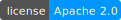

# Nordeus Challenge - Isle Heights [](https://github.com/StudentRAF/TravelGuide/blob/master/LICENSE)
Users are shown a grid map of 30x30 cells with each cell having a height value assigned to it. A
cell can either be water💧(height = 0) or land🪨(height > 0). Connected land cells represent
an island🏝️. The goal of the game is to find which island has the greatest average height.
Users can make their guess by clicking on any island and they have 3 attempts to guess the
correct island. After 3 wrong guesses or after a successful guess the game finishes and they
can choose to restart.

## Getting Started

<ins><strong>Requirements:</strong></ins>

- JDK 21 or above
- Maven 3.0.0 or above
- PostgreSQL 16.0 or above
- JavaScript package manager (npm, yarn, bun...) 

<ins><strong>Database setup:</strong></ins>

1. create PostgreSQL database scheme
2. inside script `database/insert.sql` replace placeholder path with the actual path to your thumbnails folder
3. run `database/insert.sql` script

<ins><strong>Backend setup:</strong></ins>

Create environment based on your needs:

```properties
ISLEHEIGHTS_DATABASE_JDBC=           #default: postgresql
ISLEHEIGHTS_DATABASE_HOST=           #default: localhost
ISLEHEIGHTS_DATABASE_PORT=           #default: 5432
ISLEHEIGHTS_DATABASE_SCHEME=         #default: isle_heights
ISLEHEIGHTS_DATABASE_DRIVER=         #default: org.postgresql.Driver
ISLEHEIGHTS_DATABASE_USERNAME=       #default: root
ISLEHEIGHTS_DATABASE_PASSWORD=       #default: 
ISLEHEIGHTS_CORS_ALLOWED_ORIGINS=    #default: http://localhost:5173
ISLEHEIGHTS_CORS_ALLOWED_METHODS=    #default: GET,POST,PUT,DELETE
ISLEHEIGHTS_CORS_ALLOWED_HEADERS=    #default: Content-Type,Authorization
```

<ins><strong>Frontend setup:</strong></ins>

Inside folder `frontend` create env file `.env.local` with structure:
```properties
ISLE_HEIGHTS_API_URL= #http://localhost:8000/api/v1
```
## Technologies

<ins><strong>Database:</strong></ins>

- PostgreSQL

<ins><strong>Backend:</strong></ins>

- Java
- Spring Boot

<ins><strong>Frontend:</strong></ins>

- React
- Typescript
- Tailwind
